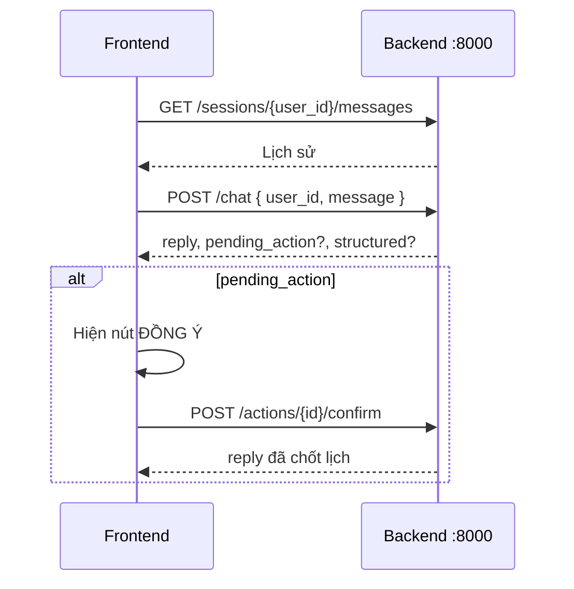

# Hướng dẫn Frontend — VinFast Smart Sales API

Tài liệu này dành cho **2 thành viên Frontend**: cài môi trường, chạy backend local, tích hợp API chat, và quy trình **merge code** với nhánh Backend / LLM / Guardrails.

**Base URL (local):** `http://localhost:8000`  
**Swagger UI:** http://localhost:8000/docs  
**OpenAPI JSON:** http://localhost:8000/openapi.json  

---

## 1. Yêu cầu hệ thống

| Thành phần | Phiên bản gợi ý |
|------------|------------------|
| Python | 3.11+ (đã test 3.14) |
| Git | 2.x |
| Node.js | 18+ (cho app React/Vite của Frontend) |
| curl hoặc Postman | Test API |

Frontend **không bắt buộc** cài OpenAI/Gemini — chỉ cần backend chạy. Nếu team chưa có LLM quota, API vẫn trả lời ở chế độ `fallback` (rule-based + RAG).

---

## 2. Cài môi trường & chạy Backend (lần đầu)

Clone repo (nếu chưa có):

```bash
git clone <url-repo> Day-3-Lab-Chatbot-vs-react-agent-a4
cd Day-3-Lab-Chatbot-vs-react-agent-a4
```

### 2.1. Virtualenv + dependencies

```bash
python3 -m venv .venv
# macOS/Linux:
source .venv/bin/activate
# Windows (PowerShell):
# Run this first if you get a script execution security error: Set-ExecutionPolicy -ExecutionPolicy RemoteSigned -Scope Process
.venv\Scripts\Activate.ps1
# Windows (CMD):
.venv\Scripts\activate.bat
# Windows (Git Bash):
source .venv/Scripts/activate

pip install -r requirements-api.txt
```

> `requirements-api.txt` = FastAPI + RAG + DB + pytest (không có `llama-cpp`, cài nhanh).  
> Chỉ cần `requirements.txt` nếu ai đó chạy model local GGUF.

### 2.2. Biến môi trường (tùy chọn cho demo có LLM)

```bash
cp .env.example .env
```

Frontend **không cần** commit file `.env`. Chỉ cần backend dev có key hợp lệ nếu muốn `mode: "agent"`.  
Nếu không có key → vẫn test UI với `mode: "fallback"`.

### 2.3. Build chỉ mục RAG (một lần, hoặc khi đổi `vinfast_rag_data.json`)

```bash
python -m src.rag.ingest
# Kết quả: data/rag_index.pkl
```

### 2.4. Chạy server

```bash
# macOS/Linux:
source .venv/bin/activate
# Windows (PowerShell):
.venv\Scripts\Activate.ps1
# Windows (CMD):
.venv\Scripts\activate.bat
# Windows (Git Bash):
source .venv/Scripts/activate

python run_api.py
```

Hoặc:

```bash
uvicorn src.api.main:app --reload --host 0.0.0.0 --port 8000
```

Kiểm tra:

```bash
curl http://localhost:8000/health
```

Kỳ vọng: `{"status":"ok", ...}`

### 2.5. CORS

Mặc định `CORS_ORIGINS=*` trong `.env.example` — Frontend chạy `localhost:5173` (Vite) gọi API **không cần proxy** nếu backend bật CORS.

Production: đặt ví dụ `CORS_ORIGINS=http://localhost:5173,https://your-app.vercel.app`

---

## 3. User demo (theo lab)

Lab hỗ trợ **1–3 user** tách lịch sử chat:

| `user_id` gợi ý | Mục đích |
|-----------------|----------|
| `user1` | Khách A |
| `user2` | Khách B |
| `user3` | Khách C |

Frontend: dropdown hoặc tab chọn `user_id` trước khi gửi tin.

---

## 4. Danh sách API (chi tiết)

### 4.1. Health

| | |
|---|---|
| **GET** | `/health` |
| **Mục đích** | Kiểm tra server + file RAG index |

**Response ví dụ:**

```json
{
  "status": "ok",
  "rag_index": "./data/rag_index.pkl",
  "index_exists": true
}
```

---

### 4.2. Gửi tin nhắn (API chính cho UI chat)

| | |
|---|---|
| **POST** | `/api/v1/chat` |
| **Content-Type** | `application/json` |

**Request body:**

| Field | Kiểu | Bắt buộc | Mô tả |
|-------|------|----------|--------|
| `user_id` | string | Có | ID phiên (user1, user2, …) |
| `message` | string | Có | Nội dung khách gửi |
| `confirm_action_id` | string | Không | ID lịch hẹn khi khách bấm **ĐỒNG Ý** (thay vì gọi endpoint confirm riêng) |

**Ví dụ — chat thường:**

```bash
curl -X POST http://localhost:8000/api/v1/chat \
  -H "Content-Type: application/json" \
  -d '{
    "user_id": "user1",
    "message": "Tôi có gia đình 4 người, phân vân VF5 và VF6, hãy so sánh giúp tôi"
  }'
```

**Response:**

```json
{
  "reply": "Dạ, ...",
  "trace_id": "uuid",
  "pending_action": null,
  "structured": { },
  "mode": "agent"
}
```

| Field response | Ý nghĩa cho UI |
|----------------|----------------|
| `reply` | Hiển thị bubble bot (markdown/text) |
| `trace_id` | Log/debug (optional hiển thị dev) |
| `pending_action` | **Khác null** → hiện nút **ĐỒNG Ý** (xem 4.3) |
| `structured` | Dữ liệu bảng so sánh VF5/VF6 (optional render table) |
| `mode` | `"agent"` = có LLM; `"fallback"` = không LLM; `"confirm"` = sau xác nhận |

**`pending_action` khi đặt lịch lái thử:**

```json
{
  "type": "test_drive",
  "id": "uuid-appointment",
  "summary": "Đã ghi nhận lịch lái thử VF8 cho Hoàng (0987...). Cần xác nhận..."
}
```

**UI gợi ý:** Khi `pending_action != null`, render card + nút **ĐỒNG Ý** → gọi confirm (mục 4.3).

**`structured` (so sánh xe):** Có thể có `models.VF5`, `models.VF6` với `highlights` (price_hint, dimensions, …) và `chunks` — dùng render bảng so sánh thay vì chỉ text.

---

### 4.3. Xác nhận hành động (nút ĐỒNG Ý)

Có **2 cách** (chọn một, thống nhất trong team):

#### Cách A — Endpoint riêng (khuyến nghị cho UI rõ ràng)

| | |
|---|---|
| **POST** | `/api/v1/actions/{action_id}/confirm` |

**Body:**

```json
{
  "user_id": "user1"
}
```

`action_id` = `pending_action.id` từ response chat.

**Response:** Giống `ChatResponse`, `pending_action: null`, `mode: "confirm"`.

```bash
curl -X POST "http://localhost:8000/api/v1/actions/<appointment-uuid>/confirm" \
  -H "Content-Type: application/json" \
  -d '{"user_id": "user1"}'
```

#### Cách B — Gửi lại qua `/chat`

```json
{
  "user_id": "user1",
  "message": "ĐỒNG Ý",
  "confirm_action_id": "<appointment-uuid>"
}
```

---

### 4.4. Lịch sử tin nhắn

| | |
|---|---|
| **GET** | `/api/v1/sessions/{user_id}/messages?limit=50` |

**Response:**

```json
{
  "user_id": "user1",
  "messages": [
    {
      "id": 1,
      "role": "user",
      "content": "...",
      "created_at": "2026-06-01T12:00:00"
    },
    {
      "id": 2,
      "role": "assistant",
      "content": "...",
      "created_at": "2026-06-01T12:00:01"
    }
  ]
}
```

**UI:** Load khi mở app / đổi `user_id`; `role` = `"user"` | `"assistant"` để căn trái/phải bubble.

---

### 4.5. Log tool (debug / màn hình admin)

| | |
|---|---|
| **GET** | `/api/v1/sessions/{user_id}/tool-logs?limit=50` |

Trả về danh sách tool agent đã gọi: `tool_name`, `arguments`, `observation`, `latency_ms`.

Dùng cho demo “minh bạch agent” hoặc panel dev — **không bắt buộc** cho chat cơ bản.

---

### 4.6. Tools trực tiếp (test / preload dữ liệu, không qua LLM)

Prefix: `/api/v1/tools`

| Method | Path | Query | Mục đích |
|--------|------|-------|----------|
| GET | `/specs` | — | Danh sách mô tả tool (cho doc UI) |
| GET | `/lookup` | `query`, `top_k=4` | Tra cứu RAG |
| GET | `/compare` | `model_a=VF5`, `model_b=VF6` | So sánh 2 xe |
| GET | `/calculate` | `expression` | Máy tính (`1090000000*0.3`) |
| GET | `/reviews` | `query`, `car_model?` | Tìm đoạn đánh giá |

Ví dụ:

```bash
curl "http://localhost:8000/api/v1/tools/compare?model_a=VF5&model_b=VF6"
```

Frontend **thường chỉ cần** `POST /chat` — các endpoint tools dùng khi mock UI hoặc trang “tra cứu nhanh”.

---

## 5. Luồng tích hợp Frontend (checklist)



1. Chọn `user_id` (user1 / user2 / user3).
2. `GET` messages → render history.
3. User gửi tin → `POST /chat` → append `reply` vào UI.
4. Nếu `structured` có dữ liệu so sánh → render **bảng** (VF5 vs VF6).
5. Nếu `pending_action` → card xác nhận + nút → `POST .../confirm`.
6. (Optional) Hiển thị badge `mode` khi dev (`agent` / `fallback`).

### Gợi ý code fetch (TypeScript)

```typescript
const API_BASE = import.meta.env.VITE_API_URL ?? "http://localhost:8000";

export async function sendChat(userId: string, message: string) {
  const res = await fetch(`${API_BASE}/api/v1/chat`, {
    method: "POST",
    headers: { "Content-Type": "application/json" },
    body: JSON.stringify({ user_id: userId, message }),
  });
  if (!res.ok) throw new Error(await res.text());
  return res.json();
}

export async function confirmAction(userId: string, actionId: string) {
  const res = await fetch(`${API_BASE}/api/v1/actions/${actionId}/confirm`, {
    method: "POST",
    headers: { "Content-Type": "application/json" },
    body: JSON.stringify({ user_id: userId }),
  });
  return res.json();
}

export async function loadHistory(userId: string) {
  const res = await fetch(`${API_BASE}/api/v1/sessions/${userId}/messages`);
  return res.json();
}
```

Tạo file `.env` phía Frontend:

```env
VITE_API_URL=http://localhost:8000
```

---

## 6. Cấu trúc thư mục liên quan (để tránh sửa nhầm khi merge)

```
Day-3-Lab-Chatbot-vs-react-agent-a4/
├── src/api/              # Backend API (đừng sửa từ Frontend)
├── src/tools/            # Tools / RAG
├── src/agent/            # ReAct (LLM owner)
├── src/services/         # Chat orchestration
├── data/                 # SQLite + rag_index (gitignore)
├── docs/
│   └── FRONTEND_GUIDE.md # File này
├── frontend/             # (đề xuất) App React/Vite của 2 bạn Frontend
│   ├── package.json
│   └── src/
├── run_api.py
└── requirements-api.txt
```

**Đề xuất:** Tạo folder `frontend/` ở root repo — 2 bạn Frontend làm việc chủ yếu trong đó, giảm conflict với `src/`.

---

## 7. Hướng dẫn Git merge (2 Frontend + Backend + LLM)

### 7.1. Nhánh gợi ý

| Nhánh | Owner | Nội dung |
|-------|--------|----------|
| `main` | Integrator / lead | Ổn định, demo được |
| `feature/backend-api` | Backend (bạn) | `src/api`, `src/tools`, `src/rag`, `src/db` |
| `feature/frontend-ui` | Frontend A+B | `frontend/**` |
| `feature/llm-agent` | LLM | `src/agent/agent.py`, prompt |
| `feature/guardrails` | Guardrails | Middleware / filter (nếu có) |

### 7.2. Quy tắc tránh conflict

| Được | Không nên |
|------|-----------|
| Frontend chỉ sửa `frontend/` | Sửa `src/tools/` khi chưa trao đổi |
| Backend/LLM sửa `src/` | Xóa `frontend/` của người khác |
| Mỗi PR nhỏ, 1 mục tiêu | PR 50 file trộn UI + agent + DB |

### 7.3. Workflow hàng ngày (mỗi Frontend)

```bash
git checkout main
git pull origin main

git checkout feature/frontend-ui
# hoặc nhánh riêng: feature/frontend-chat-ui (A), feature/frontend-confirm-ui (B)
git merge main          # lấy API mới nhất từ backend
# ... code ...
git add frontend/
git commit -m "feat(frontend): add chat layout and confirm button"
git push origin feature/frontend-ui
```

Tạo Pull Request → `main`, nhờ 1 người review.

### 7.4. Khi merge `main` vào nhánh Frontend bị conflict

```bash
git checkout feature/frontend-ui
git fetch origin
git merge origin/main
```

- Conflict trong `frontend/` → tự resolve.
- Conflict trong `src/` → **hỏi Backend/LLM**, ưu tiên giữ code `src/` từ `main` trừ khi team thống nhất.

Sau merge:

```bash
cd frontend && npm install && npm run dev
# Terminal khác:

# macOS/Linux:
source .venv/bin/activate && python run_api.py

# Windows (PowerShell):
.venv\Scripts\Activate.ps1; python run_api.py

# Windows (CMD):
.venv\Scripts\activate.bat && python run_api.py
```

### 7.5. Integrate lần đầu (cả nhóm)

1. Backend merge API vào `main`, báo Frontend: “API frozen v1”.
2. Frontend `git pull` + tạo `frontend/` + `VITE_API_URL`.
3. Test E2E: gửi chat → confirm lịch → đổi user_id.
4. LLM merge prompt sau — Frontend **không đổi** contract API trừ khi có changelog.

### 7.6. Commit message gợi ý

```
feat(frontend): chat UI with user selector
feat(frontend): comparison table from structured response
fix(frontend): handle pending_action confirm flow
docs(frontend): update API base URL in README
```

---

## 8. Xử lý lỗi thường gặp

| Triệu chứng | Nguyên nhân | Cách xử lý |
|-------------|-------------|------------|
| `mode: "fallback"` mãi | Không có LLM key / hết quota OpenAI | Vẫn demo UI; nhờ team cấp Gemini key hoặc nạp OpenAI |
| CORS error | Backend chưa chạy hoặc sai origin | Bật `python run_api.py`, kiểm tra `CORS_ORIGINS` |
| 500 khi chat | Chưa ingest RAG | `python -m src.rag.ingest` |
| `Connection refused` | Sai port / server tắt | `curl localhost:8000/health` |
| Confirm 404 | Sai `action_id` hoặc `user_id` | Dùng đúng `pending_action.id` và cùng `user_id` lúc đặt lịch |

---

## 9. Phân công 2 Frontend (gợi ý)

| Thành viên | Focus | API dùng nhiều |
|------------|--------|----------------|
| **Frontend A** | Khung chat, user selector, gửi/nhận tin, load history | `POST /chat`, `GET .../messages` |
| **Frontend B** | Bảng so sánh, nút ĐỒNG Ý, styling số tiền in đậm | `structured`, `POST .../confirm`, optional `tool-logs` |

Họp ngắn 15 phút thống nhất: design token, `user_id` flow, component `ConfirmCard`.

---

## 10. Liên hệ phụ thuộc

| Cần | Hỏi ai |
|-----|--------|
| Đổi request/response API | Backend |
| `mode` luôn fallback, cần agent | LLM + key `.env` |
| Chặn tin nhắn độc hại trước chat | Guardrails (middleware sau này) |
| Dữ liệu xe sai | Backend (RAG / `vinfast_rag_data.json`) |

---

*Tài liệu đồng bộ với API tại commit Backend hiện tại. Nếu có endpoint mới, Backend cập nhật mục 4 và báo trong PR.*
